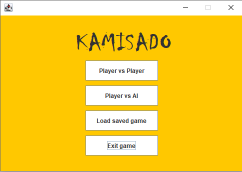
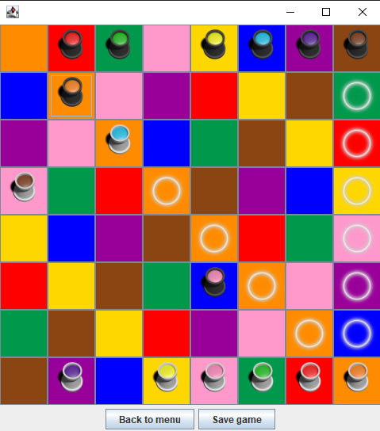
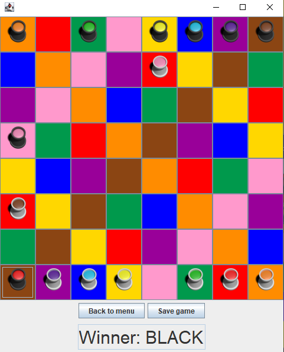

# Kamisado board game by tothdodo

## Preview

Kamisado is an abstract strategy board game for two players that's played on an 8x8 multicoloured board. Each player controls a set of eight octagonal dragon tower pieces. Each player's set of dragon towers contains a tower to match each of the colours that appear on the squares of the board. Black starts and every next step must be made with the same color where the previous player left its tower. Goal is to make the opponent's starting line with one of your towers.

## Technologies

- Java
- JavaSwing

## Functionalities

- Start a 2P game
- Start a game against AI
- Save the actual status of the current game
- Load the saved game from a *.ser* file
- Go back to menu -> Lose game status
- Play the game until stalemate or checkmate

## Screenshots

1) Menu

2) While playing

3) End game

